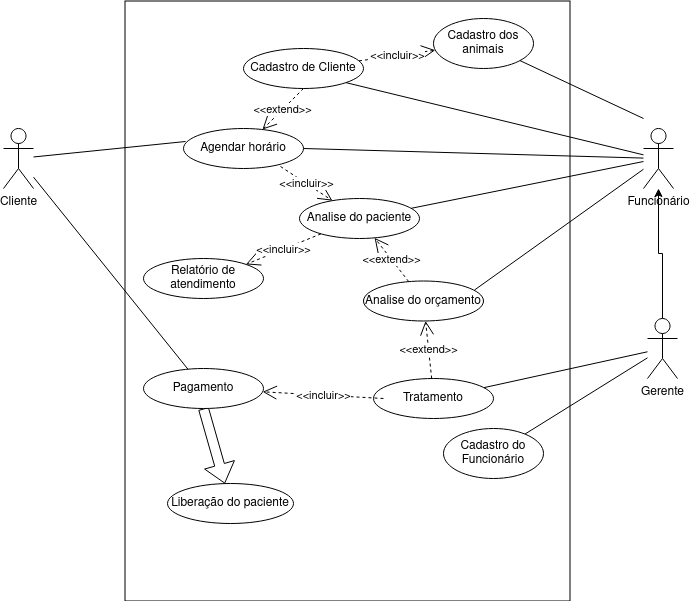

# Projeto Integrador - Veterinaria Grande Orvalho - Modelo

A seguir está um modelo de documentação para estudos relacionados à criação de um aplicativo de front-end e back-end para uma clínica veterinária. Este sistema foi apresentado e desenvolvido por estudantes do Ensino Médio integrado ao curso técnico em Informática para a Internet do IFC - Campus Araquari.

Alunos: [Miguel Bochi](github.com/MiguelBochiBarros) e [Juan Padilha](https://github.com/alujuan).

Links do projeto:

- [Documentação (esse documento)](github.com/MiguelBochi/Veterinaria-GO-Documentação)
- [Desenho](https://www.figma.com/file/VhoaWRAWHps62tjXoqMTV0/Pages_GO?type=design&node-id=0%3A1&mode=design&t=FH917MbVwo1Kk0oD-1)
- Backend: [Repositório](github.com/MiguelBochi/pi-backend) e [Publicação](github.com/MiguelBochi/pi-backend)
- Frontend: [Repositório](github.com/MiguelBochi/pi-backend) e [Publicação](github.com/MiguelBochi/pi-backend)

# Situação Problema

A Clínica Veterinária Grande Orvalho opera de maneira simples e eficiente,possuindo apenas dois funcionários, um veterinário e uma recepcionista. A recepcionista tem o trabalho de registrar animais e clientes, marcar consultas,atualizar documentos, verificar relatório e ver os registros de pagamentos. Enquanto isso, o veterinário fica responsável por escrever os relatórios de suas consultas, atualizar a ficha dos animais, criar os boletos e analisar o faturamento.

O ciclo de trabalho na clínica segue um processo simples: A recepcionista registra os cliente e seus animais, após esse passo o cliente pode requisitar uma consulta com a recepcionista, após marcada, no dia da consulta o veterinário escrever um documento registrando o estado do animal, caso o animal necessite de um tratamento para alguma enfermidade, é feito um levantamento com os custos deste tratamento e enviado para o cliente, quando o tratamento acaba o animal é liberado da veterinária.

**Descrisão da Proposta**

- O sistema desenvolvido contará como uma ferramenta para ajudar na manutenção da clínica veterinária. O sistema será desenvolvido em duas partes: Frontend que usará o React Native para dispositivos móveis e Vue 3 para serviços locais e para o Backend será usado o framework Django. Nosso sistema tem como objetivo facilitar a parte de gerenciamento dos documentos e arquivos da veterinária.

- O Aplicação mobile contará com uma série de ferramentas de uso exclusivo para clientes, sendo elas marcagem de consultas, visualização de relatórios, sistema de notificação, visualização de dados, troca de senhas.

- O Aplicação Web contará com diferente permissões para diferentes tipos de usuários. funcionários como secretarias terão acesso a criação de contas para clientes, animais e consultas, como também poderá visualizar uma lista dos animais, clientes, consultas e relatórios, enquanto do doutor poderá editar os animais e consultas, como também gerar relatórios e pagamentos.

# Regras de negócio

## Gerais

- **RN01 - Criação de consulta:** Para a criação de uma consulta é necessario que o animal e o cliente estejam cadastrados.

Para fazer o atendimento é necessário o cadastro do cliente e do animal.

- **RN02 - Consulta do paciente:** Para que ocorra a consulta é necesario que o

Para que ocorra a análise, o paciente deve estar cadastrado e com o horário marcado.

- **RN03 - Análise do orçamento:** O orçamento só pode ser registrado após a análise do paciente.
- **RN04 - Tratamento:** O tratamento só pode ser feito em um animal já cadastrado e com a análise.
- **RN05 - Pagamento e liberação do animal:** O pagamento inicial só pode ser feito após o tratamento do animal e assim, é possível haver a liberação do animal.

# Requisitos Funcionais

- # Entrada

- **RF001 - Cadastro de clientes:** O sistema deve permitir o cadastro de novos clientes e o registro de seus dados no banco de dados.

  - **Dados necessários**: Nome, Cpf, Telefone, Gmail, login, senha.
  - **Usuários**: Apenas usuarios de níveis igual ou acima de funcionário.

- **RF002 - Cadastro de animais:** O sistema deve permitir o cadastro de animais dos clientes e o registro de seus dados no banco de dados.
  - **Dados necessários**: Nome, nome do dono, tipo sanguinio, espécie, sexo, idade.
  - **Usuários**: Apenas usuários de níveis igual ou acima de funcionário.
- **RF003 Casdastro do funcionário:** O sistema deve registrar os dados cadastrados dos funcionários dentro da base de dados.
  - **Dados necessários**: Nome, Cpf, Telefone,Login, Senha, Gmail, Cargo.
  - **Usuários**: Apenas usuarios de cargo gerente.
- **RF004 Relatorio de atendimento:** O sistema deve registrar os dados do relatório informado pelo funcionário responsalvel pela consulta.
  - **Dados necessários**: Nome(Cliente),Nome(funcionário),Nome(animal), Relatorio.
  - **Usuários**: Apenas usuarios de níveis igual ou acima de funcionário.
- # Processamento
- **RF005 Autenticação de usuario:** O sistema deve comparar os dados de Cadastro Cliente ou Cadastro de funcionário para verificar a permissão de acesso ao software.
  - **Dados necessários**: login, senha.
  - **Usuários**: Todos os níveis de usuario.
- **RF006 mudar senha:** O sistema deve ser capaz de alterar os dados de senhas de Cadastro de Cliente e Cadastro de funcionário.
  - **Dados necessários**: login, CPF.
  - **Usuários**:Apenas usuários de níveis igual ou acima de funcionário.
- **RF007 Agendamento de consulta:** Usara os dados de Cadastro de Cliente e Cadastro Animal para o agendemanto.
  - **Dados necessários**: Nome(Cliente),Nome Animal,especie, sexo, data.
  - **Usuários**:Todos os usuarios.
- # Saída
- **RF008 Calendario:** O sistema deve fornecer ao usuario um calendario com as datas das consultas ou conograma de atendimento por meio do porecesso de Agendamento de consulta.
  - **Dados necessários**: login, senha, data.
  - **Usuários**: Todos os níveis de usuario.
- **RF009 Relatorio de atendimento:** O sistema deve mostrar um relatorio sobre o atendimento de seu animal.
  - **Dados necessários**: .
  - **Usuários**:Todos os níveis de usuarios.

# Requisitos não funcionais

- **RNF - Navegadores aprovados:** O sistema será reconhecido somente nos navegadores Google Chrome e Mozilla Firefox.

- **RNF - Agendamento sem cadastro:** O sistema não devera permitir agendamento sem uma conta cadastrada.

- **RNF - Cadastro de animais indefinidos:** O sistema não deve permitir o cadastro de espécies que não estão pré-definidas.

- **RNF - Consulta simultânea :** O sistema não pode permitir o agendamento de duas consultas com o mesmo funcionário ao mesmo tempo.

- **RNF005 - Registro do atendimento:** O sistema não deve permitir o resgistro do atendimento antes da consulta.

# Diagrama de Caso de Uso

